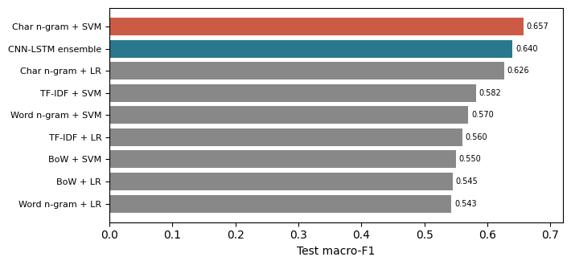
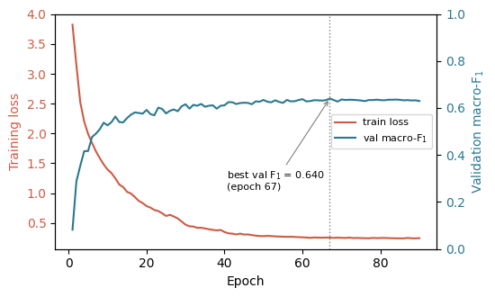
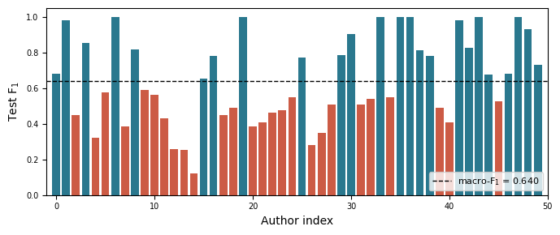
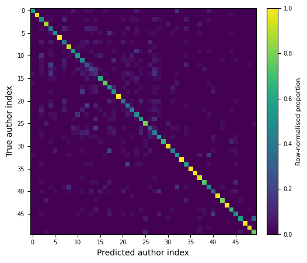
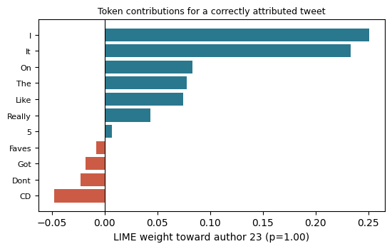

# Neural Authorship Attribution with Subword Embeddings and CNN-LSTM

**COS760 Group 38 — University of Pretoria**

Closed-set authorship attribution on short social-media text: subword BPE tokenisation, a CNN–LSTM neural classifier, sparse stylometric baselines (BoW, TF–IDF, character/word \(n\)-grams with logistic regression and linear SVM), and optional SHAP/LIME error analysis.

Implementation plan and task ownership: [`Planning/tasks.md`](Planning/tasks.md).
Final report (compiled PDF + LaTeX source): [`report/acl_latex.pdf`](report/acl_latex.pdf).

---

## Results summary

Held-out **test** set (50 authors, stratified 70/15/15, seed 42). The CNN–LSTM is a 3-seed ensemble (seeds 42, 5, 98; majority vote). All numbers below are read directly from [`results/metrics.json`](results/metrics.json).

| System | Acc. | P\(_\text{macro}\) | R\(_\text{macro}\) | F1\(_\text{macro}\) |
|--------|-----:|------:|------:|------:|
| **Char \(n\)-gram + SVM** | 0.662 | 0.658 | 0.662 | **0.657** |
| CNN–LSTM ensemble | 0.638 | 0.651 | 0.638 | 0.640 |
| Char \(n\)-gram + LR | 0.634 | 0.633 | 0.634 | 0.626 |
| TF–IDF + SVM | 0.586 | 0.583 | 0.586 | 0.582 |
| Word \(n\)-gram + SVM | 0.577 | 0.573 | 0.577 | 0.570 |
| BoW + SVM | 0.544 | 0.568 | 0.544 | 0.550 |

The strongest classical baseline (character \(n\)-grams + linear SVM, 0.657 macro-F1) narrowly leads the neural ensemble (0.640). Character-level features remain highly sample-efficient on short, noisy microtext.



**Training dynamics** (best ensemble member, seed 5): training loss falls steadily while validation macro-F1 rises and plateaus; the best checkpoint is selected before early stopping.



**Per-author F1** spans a wide range — several authors are perfectly identified while a long tail (authors 4, 13, 14) drags the macro average down, reflecting stylistic overlap on short posts.



**Confusion matrix** (row-normalised): a bright diagonal with off-diagonal mass concentrated on a few author pairs that share post length and topical vocabulary.



**Explainability (LIME).** Running LIME on the shipped checkpoint makes individual decisions inspectable. For a tweet correctly attributed to author 23 (\(p \approx 1.0\)), the strongest cues are **capitalised function words** ("I", "It", "On", "The", "Like") — this author title-cases nearly every word, a stylistic rather than topical signal. Regenerate with `python -m experiments.make_explainability_figure`.



A trained, loadable checkpoint ships under [`artifacts/best_model_bundle/`](artifacts/best_model_bundle) (`model.pt`, `tokeniser.json`, `training.json`) — see [Evaluate a saved bundle](#3-evaluate-a-saved-bundle).

---

## Quick start

**Requirements:** Python **3.10+**, Git on `PATH` (for `--fetch-dataset`).

```powershell
# From this folder (repository root)
python -m venv .venv
.\.venv\Scripts\Activate.ps1
python -m pip install --upgrade pip
pip install -r requirements.in
```

**macOS / Linux:** use `source .venv/bin/activate` instead of the PowerShell activate line.

For a pinned environment after a successful install:

```bash
pip freeze > requirements-locked.txt
pip install -r requirements-locked.txt   # on another machine
```

---

## Run experiments

All commands assume the **current directory is this repository root** (the folder containing `src/`, `experiments/`, and `tests/`).

### 1. Fetch data and train CNN–LSTM

The default dataset is the Chanchal **50 authors × 200 tweets** slice (`DEFAULT_CHANCHAL_200_CSV` in `src/dataset.py`). If the CSV is missing locally, add `--fetch-dataset` to shallow-clone [AuthorIdentification](https://github.com/chanchalIITP/AuthorIdentification) into `data/AuthorIdentification/`.

```bash
python -m experiments.run_cnn_lstm --fetch-dataset
```

**Reported ensemble run** (results referenced in the final report):

**Hardware:** Windows 11 workstation, **NVIDIA GeForce RTX 5090** GPU, **Intel Core i9** CPU. CUDA training with automatic mixed precision when available.

**Exact command:**

```bash
python -m experiments.run_cnn_lstm --fetch-dataset --epochs 90 --patience 24 --split-seed 42 --ensemble-train-seeds "42,5,98" --batch-size 748 --lr 9e-4 --vocab-size 12288 --no-live-plot
```

Same stratified split (`--split-seed 42`); ensemble members use training seeds `42`, `5`, and `98`. `--no-live-plot` disables the optional live plotting hook (TensorBoard event files may still be written unless you also pass `--no-tensorboard-server`; see `--help`).

**Outputs:**

| Path | Contents |
|------|----------|
| `results/metrics.json` | CNN–LSTM and baseline metrics (when both pipelines have run) |
| `artifacts/runs/<label>_<UTC>/` | Per-run `model.pt`, `tokeniser.json`, `training.json` |
| `artifacts/best_model_bundle/` | Promoted best bundle (strict val macro-F1 improvement) |
| `artifacts/tokeniser.json` | Tokeniser from the latest training invocation |

Use `python -m experiments.run_cnn_lstm --help` for all flags (batch size, LR schedule, class weights, ensemble seeds, etc.).

### 2. Run sparse baselines only

```bash
python -m experiments.run_baselines --fetch-dataset --seed 42
```

Trains **four feature families × two linear classifiers** (BoW, TF–IDF, char wb \(n\)-grams, word \(n\)-grams; LogisticRegression + LinearSVC). Metrics merge into `results/metrics.json`.

### 3. Evaluate a saved bundle

```bash
python -m experiments.load_cnn_checkpoint --promoted-best --eval --fetch-dataset
```

Loads `artifacts/best_model_bundle/` (or `--artifact artifacts/runs/<run_dir>` for a specific run) and reports train/validation/test metrics on the same stratified split recorded in `training.json`.

### 4. Regenerate report figures

The graphs in this README and in the report (`report/`) are reproducible from saved outputs. Requires `matplotlib` (and `lime` for the explainability figure) from `requirements.in`.

```bash
# Confusion matrix, per-class F1, training curves, systems comparison
python -m experiments.make_report_figures

# LIME token-attribution figure (loads artifacts/best_model_bundle/)
python -m experiments.make_explainability_figure
```

| Script | Reads | Writes |
|--------|-------|--------|
| `make_report_figures.py` | `results/metrics.json`, a member `training.json` | `confusion_matrix.pdf`, `per_class_f1.pdf`, `training_curves.pdf` (+ PNGs) |
| `make_explainability_figure.py` | `artifacts/best_model_bundle/` + dataset | `explainability_lime.pdf` (+ PNG) |

Both default to writing the report's `figures/` (PDF) and `docs/figures/` (PNG); override with `--out-dir` / `--png-dir`. The LIME script reproduces the stratified split from `training.json`, finds a confidently and correctly attributed test tweet, and plots its per-token LIME contributions.

---

## Pipeline overview

```
Raw text
  → Preprocessor (URLs, @mentions, whitespace; punctuation kept by default)
  → SubwordTokeniser (BPE on train split; optional punctuation isolation)
  → Embedding + dropout
  → Parallel Conv1d (k=2,3,4) + ReLU; pad each map to length T; concat channels
  → Stacked LSTM over T
  → Global max-over-time → linear head → author logits
```

Sparse baselines share the same cleaned text and stratified splits but use sklearn vectorisers + linear classifiers (`src/features.py`, `src/sparse_baselines.py`).

---

## Project layout

```
.
├── Planning/tasks.md       # Implementation plan (same as course repo)
├── src/                    # Core library
│   ├── dataset.py          # Load CSV/JSON, stratified 70/15/15 splits
│   ├── preprocessing.py    # Text cleaning
│   ├── tokeniser.py        # BPE / WordPiece (HuggingFace tokenizers)
│   ├── model.py            # CNNLSTMModel
│   ├── trainer.py          # Training loop, early stopping, AMP
│   ├── features.py         # Baseline vectorisers
│   ├── sparse_baselines.py # 4×2 baseline grid
│   ├── evaluate.py         # Metrics + confusion matrix
│   └── explainability.py   # SHAP / LIME / error analysis
├── experiments/
│   ├── run_cnn_lstm.py            # End-to-end neural pipeline
│   ├── run_baselines.py          # Baseline-only pipeline
│   ├── load_cnn_checkpoint.py    # Evaluate a saved bundle
│   ├── make_report_figures.py    # Confusion matrix, per-class F1, training curves
│   └── make_explainability_figure.py  # LIME token attributions
├── tests/                  # pytest + hypothesis property tests
├── data/                   # Dataset fetch helpers (CSV not committed)
├── report/                 # Final report: acl_latex.pdf + LaTeX source + figures
├── docs/figures/           # Result graphs used in this README
├── artifacts/              # best_model_bundle/ ships a trained checkpoint; runs/ generated at runtime
└── results/                # metrics.json (bundled) written by experiment scripts
```

---

## Dataset format

CSV or JSON with **text** and **author** columns (case-insensitive headers, e.g. `Text` / `Author` for Chanchal exports). Each author needs at least **10** samples for the default stratified split (`min_samples` in `DatasetLoader.split`).

See [`data/README.md`](data/README.md) for fetch details and byte-string decoding in the Chanchal export.

---

## Tests

```bash
python -m pytest tests/ -v
```

Smoke test on synthetic data:

```bash
python -m pytest tests/test_pipeline.py -v
```

---

## GPU notes

Training auto-selects batch size and DataLoader workers from available hardware (`src/training_hardware.py`). For CUDA, install a **GPU build** of PyTorch from [pytorch.org](https://pytorch.org/get-started/locally/). Training uses mixed precision when supported; disable with `--no-amp`.

Verify CUDA:

```bash
python -c "import torch; print(torch.__version__, torch.cuda.is_available())"
```

---

## Key defaults (`run_cnn_lstm.py`)

| Setting | Default |
|---------|---------|
| Split seed | `42` (override with `--split-seed`) |
| Learning rate | `8e-4` |
| Weight decay | `1e-4` |
| Label smoothing | `0.02` |
| Dropout | `0.30` |
| Embed dim / filters | `256` / `256` per kernel |
| LSTM hidden / layers | `384` / `2` |
| Vocab size / max seq | `10000` / `384` |
| Epochs / patience | `100` / `24` |
| Class weights | `balanced` (`--class-weight none` to disable) |
| LR schedule | `plateau` (ReduceLROnPlateau on val macro-F1) |

---

## Licence and attribution

Dataset: [Chanchal et al., AuthorIdentification](https://github.com/chanchalIITP/AuthorIdentification). Code written for COS760 Group 38.
